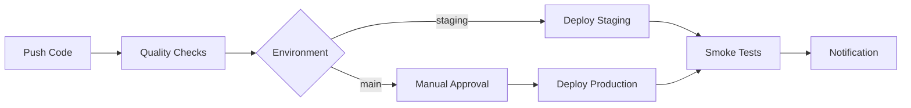

# 🧾 Receipt API - Scanner de Tickets avec Google Sheets

Application web moderne pour scanner des tickets de caisse et les enregistrer automatiquement dans Google Sheets avec authentification Google OAuth et traitement par Document AI.

## 📋 Table des matières

- [Architecture](#architecture)
- [Fonctionnalités](#fonctionnalités)
- [Développement Local](#développement-local)
- [Configuration](#configuration)
- [Variables d'environnement](#variables-denvironnement)
- [Cache-busting et Déploiement](#cache-busting-et-déploiement)
- [CI/CD Pipeline](#cicd-pipeline)
- [Monitoring et Observabilité](#monitoring-et-observabilité)
- [Sécurité](#sécurité)
- [Troubleshooting](#troubleshooting)
- [Support](#support)

## 🏗️ Architecture

### Vue d'ensemble
```
┌─────────────────┐    ┌─────────────────┐    ┌─────────────────┐
│   Frontend SPA  │    │   Backend PHP   │    │   Google Cloud  │
│   (Bootstrap)   │◄──►│   (Apache)      │◄──►│   Services      │
│   - Vue unique  │    │   - OAuth       │    │   - Document AI │
│   - Scan simple │    │   - API REST    │    │   - Sheets API  │
│   - Scan multi  │    │   - Validation  │    │   - OAuth       │
└─────────────────┘    └─────────────────┘    └─────────────────┘
```

### Stack technique
- **Frontend** : HTML5, Bootstrap 5, JavaScript ES6+
- **Backend** : PHP 8.1, Apache, Composer
- **Base de données** : Google Sheets API
- **IA** : Google Document AI
- **Authentification** : Google OAuth 2.0
- **Déploiement** : Google Cloud Run
- **CI/CD** : GitHub Actions
- **Conteneurisation** : Docker

### Structure du projet
```
receipt-api-local-google-parser/
├── .github/workflows/          # CI/CD GitHub Actions
│   ├── quality-checks.yml     # Validation qualité code
│   ├── deploy-staging.yml     # Déploiement staging
│   ├── deploy-production.yml  # Déploiement production
│   └── cache-bust.yml         # Cache-busting manuel
├── backend/                   # Backend PHP
│   ├── index.php             # Point d'entrée API
│   ├── app.php               # Logique métier
│   ├── bootstrap.php         # Initialisation + validation
│   └── composer.json         # Dépendances PHP
├── frontend/                 # Frontend SPA
│   ├── index.html            # Interface utilisateur
│   └── assets/               # CSS, JS, images
├── infra/                    # Infrastructure
│   ├── docker-compose.yml    # Environnement local
│   ├── Dockerfile            # Image Docker
│   ├── apache/               # Configuration Apache
│   └── .env.example          # Variables d'environnement
├── scripts/                  # Scripts utilitaires
│   ├── build-assets.sh       # Build avec cache-busting
│   ├── cache-bust-safe.sh    # Cache-busting sécurisé
│   └── deploy-with-cache-bust.sh # Déploiement automatisé
├── .htaccess                 # Routage Apache (autorité unique)
├── Makefile                  # Commandes de développement
└── README.md                 # Documentation
```

## ✨ Fonctionnalités

### 🔐 Authentification et Autorisation
- **Google OAuth 2.0** : Connexion sécurisée avec Google
- **Liste d'emails autorisés** : Contrôle d'accès par `ALLOWED_EMAILS`
- **Protection des endpoints** : Seul `/api/config` accessible sans authentification
- **Gestion des sessions** : Tokens JWT avec validation d'audience
- **Changement de compte** : Possibilité de switcher entre comptes Google

### 📱 Interface Utilisateur
- **Design responsive** : Bootstrap 5 avec thème sombre
- **Mode scan unique** : Un ticket à la fois avec aperçu
- **Mode scan multiple** : Plusieurs tickets en batch
- **Statut de connexion** : Indicateurs visuels avec points colorés
- **Monitoring des services** : État en temps réel de `/health` et `/ready`
- **Validation en temps réel** : Feedback immédiat sur les actions

### 🧾 Traitement des Tickets
- **Scan par caméra** : Capture directe depuis l'appareil
- **Upload de fichiers** : Support des formats image courants
- **Document AI** : Extraction automatique des données (marchand, date, total)
- **Validation manuelle** : Correction des données extraites
- **Enregistrement Sheets** : Sauvegarde automatique dans Google Sheets

### 🚀 Performance et Optimisation
- **Cache-busting automatique** : Invalidation du cache navigateur
- **Assets optimisés** : Minification CSS/JS en production
- **Hot reload** : Développement local avec rechargement automatique
- **Compression** : Gzip et headers de cache optimisés

## 🛠️ Développement Local

### Prérequis
- Docker et Docker Compose
- Git
- Compte Google Cloud Platform
- Service Account avec permissions Document AI et Sheets

### Installation rapide

```bash
# 1. Cloner le projet
git clone <repository-url>
cd receipt-api-local-google-parser

# 2. Configuration initiale
make setup

# 3. Configurer les variables d'environnement
# Éditer infra/.env avec vos valeurs

# 4. Placer le service account
# Copier votre sa-key.json dans backend/keys/

# 5. Démarrer l'application
make up

# 6. Tester
make smoke-test
```

### Commandes de développement

```bash
# Configuration
make setup              # Configuration initiale

# Docker
make up                 # Démarrer les conteneurs
make down               # Arrêter les conteneurs
make restart            # Redémarrer la stack
make logs               # Voir les logs
make ps                 # État des services
make sh-app             # Shell dans le conteneur

# Développement
make cache-bust         # Cache-busting automatique
make build-assets       # Build des assets avec hash

# Tests
make smoke-test         # Tests locaux
make smoke-test-staging # Tests staging
make smoke-test-prod    # Tests production

# Qualité de code
make lint               # Linter (JS + PHP)
make check-quality      # Vérifications complètes
make format             # Formatage automatique
```

### Hot Reload
Le système de hot reload est configuré pour :
- **Backend PHP** : Modifications instantanées des fichiers PHP
- **Frontend** : Rechargement automatique des assets HTML/CSS/JS
- **Variables d'environnement** : Rechargement via `make restart`

## ⚙️ Configuration

### Variables d'environnement obligatoires

Créer `infra/.env` basé sur `infra/.env.example` :

```bash
# Environnement
APP_ENV=local
DEBUG=1

# Google Cloud Configuration
GCP_PROJECT_ID=scan-document-ai
GCP_LOCATION=eu

# Google OAuth
GOOGLE_OAUTH_CLIENT_ID=your-oauth-client-id.googleusercontent.com

# Google Sheets
SPREADSHEET_ID=your-spreadsheet-id
DEFAULT_SHEET=Sheet1

# Document AI
GCP_PROCESSOR_ID=your-document-ai-processor-id

# Sécurité
ALLOWED_EMAILS=your-email@gmail.com
ALLOWED_ORIGINS=http://localhost:8080

# Configuration de l'application
WHO_COLUMNS={"Mickael":["A","B","C"],"Marie":["D","E","F"]}
MAX_BATCH_UPLOADS=10

# Credentials
GOOGLE_APPLICATION_CREDENTIALS=/var/www/html/keys/sa-key.json
```

### Configuration Google Cloud

1. **Créer un projet GCP** et activer les APIs :
   - Document AI API
   - Google Sheets API
   - Google OAuth 2.0

2. **Créer un Service Account** avec permissions :
   - Document AI Editor
   - Google Sheets Editor

3. **Télécharger la clé JSON** et la placer dans `backend/keys/sa-key.json`

4. **Configurer OAuth** :
   - Créer des identifiants OAuth 2.0
   - Ajouter `http://localhost:8080` aux origines autorisées
   - Récupérer le Client ID

### Configuration Google Sheets

1. **Créer un Google Sheet** avec les colonnes :
   - A : Qui (nom de la personne)
   - B : Intitulé (marchand)
   - C : Date
   - D : Total

2. **Partager avec le Service Account** (email du SA)

3. **Récupérer l'ID** du spreadsheet depuis l'URL

## 📊 Variables d'environnement

### Variables obligatoires
- `GCP_PROJECT_ID` : ID du projet Google Cloud
- `GOOGLE_OAUTH_CLIENT_ID` : Client ID OAuth Google
- `SPREADSHEET_ID` : ID du Google Sheet
- `ALLOWED_EMAILS` : Liste des emails autorisés (séparés par virgules)
- `GCP_PROCESSOR_ID` : ID du processeur Document AI

### Variables optionnelles
- `APP_ENV` : Environnement (local/prod) - défaut : local
- `DEBUG` : Mode debug (0/1) - défaut : 1
- `WHO_COLUMNS` : Mapping des colonnes par utilisateur (JSON)
- `MAX_BATCH_UPLOADS` : Limite d'uploads en batch - défaut : 10
- `DEFAULT_SHEET` : Feuille par défaut - défaut : Sheet1

### Format WHO_COLUMNS
```json
{
  "Nom Utilisateur": ["Colonne1", "Colonne2", "Colonne3"],
  "Autre Utilisateur": ["A", "B", "C"]
}
```

## 🚀 Cache-busting et Déploiement

### Cache-busting automatique

Le système de cache-busting automatique garantit que les utilisateurs reçoivent toujours les dernières versions des assets CSS/JS.

#### Commandes disponibles

```bash
# Cache-busting simple
make cache-bust

# Déploiement avec cache-busting automatique
make deploy-staging    # Déploiement vers staging
make deploy-prod       # Déploiement vers production
```

#### Workflow CI/CD

Le cache-busting est automatiquement intégré dans les workflows GitHub Actions :

1. **Quality Checks** : Validation du système de cache-busting
2. **Deploy Staging** : Cache-busting automatique avant déploiement
3. **Deploy Production** : Cache-busting automatique avant déploiement
4. **Cache-bust Workflow** : Workflow dédié pour cache-busting manuel

#### Déclenchement automatique

- **Modification des assets** (`frontend/assets/**`) → Cache-busting automatique
- **Push sur staging** → Cache-busting + déploiement
- **Push sur main** → Cache-busting + déploiement (avec approbation)

### Plan de déploiement en production

#### Étapes obligatoires :

1. **Vérification préalable :**
   ```bash
   make up
   make smoke-test
   ```

2. **Commit et push vers staging :**
   ```bash
   git add .
   git commit -m "feat: description des changements"
   git push origin staging
   ```

3. **Vérification du déploiement staging :**
   - Aller sur GitHub Actions
   - Vérifier que le workflow "Deploy to Staging" passe
   - Tester l'URL de staging

4. **Merge vers main pour production :**
   ```bash
   git checkout main
   git merge staging
   git push origin main
   ```

5. **Approbation production :**
   - Aller sur GitHub Actions
   - Cliquer sur "Approve" pour le déploiement production
   - Attendre la fin du déploiement

## 🔄 CI/CD Pipeline

### Workflows GitHub Actions

#### 1. Quality Checks (`quality-checks.yml`)
- **Déclenchement** : Push/PR sur main, staging, develop
- **Actions** :
  - Linting JavaScript (ESLint)
  - Linting PHP (PHPCS)
  - Validation de la structure du projet
  - Vérification des variables d'environnement
  - Validation du système de cache-busting
  - Vérification de la documentation

#### 2. Deploy Staging (`deploy-staging.yml`)
- **Déclenchement** : Push sur staging
- **Actions** :
  - Cache-busting automatique
  - Build et push Docker
  - Déploiement Cloud Run
  - Smoke tests automatiques
  - Notification de succès/échec

#### 3. Deploy Production (`deploy-production.yml`)
- **Déclenchement** : Push sur main (avec approbation manuelle)
- **Actions** :
  - Cache-busting automatique
  - Build et push Docker
  - Déploiement Cloud Run (avec validation)
  - Smoke tests automatiques
  - Notification de succès/échec

#### 4. Cache-bust Workflow (`cache-bust.yml`)
- **Déclenchement** : Manuel ou modification des assets
- **Actions** :
  - Cache-busting automatique
  - Commit automatique avec `[skip ci]`
  - Push vers la branche appropriée

### Pipeline de déploiement



## 📊 Monitoring et Observabilité

### Endpoints de santé

#### `/health` - Liveness Probe
- **Méthode** : GET
- **Authentification** : Non requise
- **Réponse** : Statut de l'application (en vie)

```json
{
  "ok": true,
  "status": "alive",
  "timestamp": "2025-10-07T23:34:57+00:00"
}
```

#### `/ready` - Readiness Probe
- **Méthode** : GET
- **Authentification** : Non requise
- **Réponse** : Statut des services (prêt)

```json
{
  "ok": true,
  "status": "ready",
  "credentials": {
    "valid": true,
    "project_id": "scan-document-ai",
    "client_email": "docai-sa@scan-document-ai.iam.gserviceaccount.com"
  },
  "timestamp": "2025-10-07T23:34:57+00:00"
}
```

### Monitoring frontend

L'interface affiche en temps réel l'état des services :
- **🟢 ● App** : Application en vie
- **🟢 ● Services** : Services opérationnels (PHP + DocAI)
- **🔴 ● Error** : Service en erreur
- **🔴 ● Offline** : Service inaccessible

### Logging structuré

Tous les logs sont au format JSON avec :
- Timestamp ISO 8601
- Niveau de log (info, warn, error)
- Message descriptif
- Contexte (endpoint, méthode, user-agent)
- Données spécifiques à l'événement

### Métriques Cloud Run

- **Requêtes par seconde**
- **Latence de réponse**
- **Taux d'erreur**
- **Utilisation CPU/Mémoire**
- **Durée d'exécution**

## 🔒 Sécurité

### Authentification et autorisation

1. **Google OAuth 2.0** : Authentification centralisée
2. **Liste d'emails autorisés** : Contrôle d'accès strict
3. **Validation des tokens** : Vérification audience et expiration
4. **Protection des endpoints** : Seul `/api/config` accessible sans auth

### Protection des données

1. **Chiffrement en transit** : HTTPS obligatoire
2. **Variables d'environnement** : Secrets dans Google Secret Manager
3. **Service Account** : Permissions minimales requises
4. **Validation des entrées** : Sanitisation des données utilisateur

### Sécurité applicative

1. **CORS configuré** : Origines autorisées uniquement
2. **Headers de sécurité** : Protection XSS, CSRF
3. **Validation stricte** : Format WHO_COLUMNS validé
4. **Fail-fast** : Arrêt immédiat si configuration invalide

### Endpoints sécurisés

- **`/api/config`** : Public (pas d'authentification)
- **`/health`, `/ready`** : Public (monitoring)
- **Tous les autres `/api/*`** : Authentification Google OAuth requise

## 🔧 Troubleshooting

### Problèmes courants

#### Port 8080 ne répond pas
```bash
# Vérifier que Docker est démarré
docker ps

# Vérifier les logs
make logs

# Redémarrer si nécessaire
make restart

# Vérifier la configuration Apache
docker compose exec app apache2ctl configtest

# Vérifier les permissions
ls -la frontend/
```

#### Erreurs d'authentification
```bash
# Vérifier les variables d'environnement
docker compose exec app env | grep GOOGLE

# Vérifier le service account
docker compose exec app ls -la /var/www/html/keys/

# Vérifier les permissions GCP
gcloud projects get-iam-policy scan-document-ai
```

#### Erreurs de déploiement
```bash
# Vérifier les secrets GCP
gcloud secrets list

# Vérifier les workflows GitHub Actions
# Aller sur https://github.com/[repo]/actions

# Vérifier les logs Cloud Build
gcloud builds list --limit=10
```

#### Cache-busting ne fonctionne pas
```bash
# Vérifier que le script existe
ls -la scripts/cache-bust-safe.sh

# Lancer manuellement
make cache-bust

# Vérifier les changements
git diff frontend/index.html
```

### Logs utiles

#### Logs applicatifs
```bash
# Logs en temps réel
make logs

# Logs Apache
docker compose exec app tail -f /var/log/apache2/error.log

# Logs PHP
docker compose exec app tail -f /var/log/php_errors.log
```

#### Logs de déploiement
```bash
# Logs Cloud Run
gcloud logging read "resource.type=cloud_run_revision" --limit=50

# Logs Cloud Build
gcloud builds log [BUILD_ID]
```

### Commandes de diagnostic

```bash
# État complet du système
make ps
docker compose exec app php -v
docker compose exec app apache2ctl -v

# Test des endpoints
curl -v http://localhost:8080/health
curl -v http://localhost:8080/ready
curl -v http://localhost:8080/api/config

# Vérification des permissions
docker compose exec app ls -la /var/www/html/
docker compose exec app ls -la /var/www/html/keys/
```

## 📞 Support

### Contacts
- **Email** : polmickael3@gmail.com
- **Logs** : Cloud Logging (GCP Console)
- **Monitoring** : Cloud Run metrics

### Ressources utiles
- **Documentation Google Cloud** : https://cloud.google.com/docs
- **Documentation Document AI** : https://cloud.google.com/document-ai/docs
- **Documentation Sheets API** : https://developers.google.com/sheets/api

### Checklist de déploiement

#### Avant le déploiement
- [ ] Tests locaux passent (`make smoke-test`)
- [ ] Variables d'environnement configurées
- [ ] Service account avec bonnes permissions
- [ ] Google Sheet partagé avec le service account

#### Pendant le déploiement
- [ ] Workflow GitHub Actions en cours
- [ ] Cache-busting appliqué automatiquement
- [ ] Build Docker réussi
- [ ] Déploiement Cloud Run réussi

#### Après le déploiement
- [ ] Smoke tests passent
- [ ] Interface utilisateur accessible
- [ ] Authentification Google fonctionne
- [ ] Scan et enregistrement fonctionnent
- [ ] Monitoring des services opérationnel

---

## 📝 Changelog

### Version actuelle
- ✅ Système de cache-busting automatique
- ✅ CI/CD pipeline complet avec GitHub Actions
- ✅ Monitoring des services en temps réel
- ✅ Interface utilisateur améliorée avec indicateurs de statut
- ✅ Sécurité renforcée avec validation stricte
- ✅ Documentation complète et détaillée
- ✅ Hot reload pour le développement local
- ✅ Scripts de déploiement automatisés

### Prochaines améliorations
- 🔄 Dashboard d'administration
- 🔄 Analytics d'utilisation
- 🔄 Support multi-langues
- 🔄 API webhooks pour intégrations